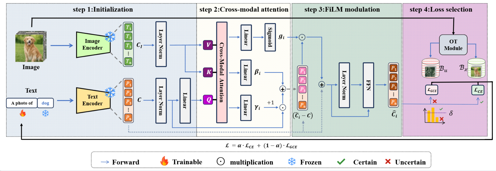

# Seeing is Believing: Robust Vision-Guided Cross-Modal Prompt Learning under Label Noise

  

  <b>Official repository for</b> 
  <a href="https://github.com/gezbww/VisPrompt">
    <i>Robust Multimodal Large Language Models Against Modality Conflict</i>
  </a>

  

---

## 📄 License

---

## 📖 Citation

---
